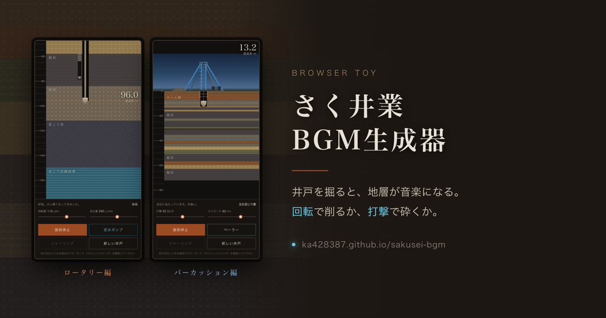

# さく井業BGM生成器

井戸を掘ると、地層が音楽になる。ブラウザだけで動く、1ファイル完結の掘削シミュレーターです。
工法違いで2つあります。

**[▶ どちらを掘るか選ぶ](https://ka428387.github.io/sakusei-bgm/)**



| | [ロータリー編](https://ka428387.github.io/sakusei-bgm/rotary/) | [パーカッション編](https://ka428387.github.io/sakusei-bgm/percussion/) |
|---|---|---|
| 掘り方 | ビットを回して削る | 綱で吊った工具を落として砕く |
| 深さ | およそ200m | およそ50m |
| 速さ | 時間 約5,000倍 | 時間 約1,000倍 |
| 操作 | 回転数・送水量・泥水ポンプ | 打撃数・ストローク・ベーラー |
| 掘りカス | 泥水で循環させて排出 | ベーラーで汲み上げる |
| 曲の骨格 | 16分音符グリッドの連続 | 打撃が拍、ベーラー工程が間奏 |

## ロータリー編

泥水を循環させて孔壁を保ちながら掘り下げます。**泥水ポンプ**を入れないと深さ4mから先に進めません。
砂れき層では送水量が225 L/min を下回ると逸泥して掘進がほぼ止まります。回転数はそのままテンポになります。
花こう岩の破砕帯にある裂か水に当たれば出水、所定深度でケーシングを建て込んで完成です。

## パーカッション編

昔ながらの綱掘りです。打撃で砕いた掘りカスが孔底に溜まると打撃が効かなくなるので、
**ベーラー**を入れて汲み上げます。引き上げ・投入・排出のあいだは打撃が止まり、
ウインチの爪音とワイヤーの軋みだけが残る間奏になります。水は下部の砂れき層から出ます。
掘りカスは地表に山として積み上がっていきます。

## トラブル

どちらも、深く掘るほど事故が増えます。

- **孔壁崩壊** — 数メートル埋まり、掘り直しになります
- **ビットの固着** — ジャーリングで抜けを試みます。**ジャーリング**ボタンを叩くと復旧が早まり、成功率も少し上がります
- 抜けなかった場合は孔をセメントで埋め、少し上から掘り直し。捨てた孔と残置ビットは地層図に残ります

発生後の対処は全自動で進みます。プレイヤーにできるのは予防だけです。

## 技術メモ

- 依存ライブラリなし。各版とも HTML/CSS/JS 1ファイル、ビルド不要
- 音は Web Audio API でその場で合成（音源ファイルなし）。地層ごとに5音音階・ルート音・音色を持たせています
- スケジューラは `setInterval`、描画は `requestAnimationFrame` に分離（非表示タブで rAF が止まるため）
- 地層はロード毎に生成されるので、毎回ちがう井戸になります
- `prefers-reduced-motion` に対応

## 構成

```
index.html            入口（工法を選ぶ）
rotary/index.html     ロータリー編
percussion/index.html パーカッション編
```

## 動作環境

Chrome / Safari / Firefox の最新版。iOS では端末のサイレントスイッチが入っていると音が鳴りません。

## ライセンス

MIT
